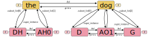

# Aligned TextGrid


[](https://github.com/Forced-Alignment-and-Vowel-Extraction/alignedTextGrid/actions/workflows/test_and_run.yml)
[](https://codecov.io/gh/Forced-Alignment-and-Vowel-Extraction/alignedTextGrid)
[](https://codeclimate.com/github/Forced-Alignment-and-Vowel-Extraction/alignedTextGrid/maintainability)
[](https://forced-alignment-and-vowel-extraction.github.io/alignedTextGrid/)
[](https://zenodo.org/badge/latestdoi/552633207)

The aligned-textgrid package provides a python interface for
representing and operating on TextGrids produced by forced aligners like
[FAVE](https://github.com/JoFrhwld/FAVE) or the [Montreal Forced
Aligner](https://montreal-forced-aligner.readthedocs.io/en/latest/).
Classes provided by aligned-textgrid represent hierarchical and
precedence relationships among data stored in TextGrid formats allowing
for simplified and more accessible analysis of aligned speech data.

## Example Use Cases

- You want to quickly loop through the Phone tier of a Textgrid, and
  *also* access information about the word it is a part of.
- You want to quickly loop over the Word tier of a Textgrid and quickly
  count how many phones it has.
- You want to programmatically merge together adjacent Textgrid
  intervals.

For examples on how to use the pacakge, see the [Usage](https://forced-alignment-and-vowel-extraction.github.io/alignedTextGrid/usage) pages.

## Installation

<!-- TODO: documnet other package managers like conda -CB 14 March 2023 -->

To install aligned-textgrid using pip, run the following command in your
terminal:

``` bash
pip install aligned-textgrid
```

## Not another TextGrid implementation

There are several other packages that parse Praat Textgrids, including

- [praatio](http://timmahrt.github.io/praatIO/praatio.html)
- [textgrid](https://github.com/kylebgorman/textgrid)

`aligned-textgrid`’s goal is to capture hierarchical and sequential
relationships represented in many TextGrids, and to make them easilly
accessible to users via an intuitive interface. The goal is that from
any arbitrary location within a TextGrid, users can easilly access
information with minimally defensive coding.



### Example

As an example, we’ll read in a textgrid produced with forced alignment
that contains a single speaker with a word and phone tier.

``` python
from aligned_textgrid import AlignedTextGrid, Word, Phone
tg = AlignedTextGrid(
    textgrid_path='doc_src/usage/resources/josef-fruehwald_speaker.TextGrid', 
    entry_classes=[Word, Phone]
    )
```

Then, we can access an arbitrary phone interval.

``` python
arbitrary_interval = tg[0].Phone[20]
```

From this aribitrary interval, we can access information about the
intervals preceding and following with the `.prev` and `.fol`
attributes.

``` python
print(arbitrary_interval.prev.label)
print(arbitrary_interval.label)
print(arbitrary_interval.fol.label)
```

    R
    EY1
    N

We can also access information about the word this interval is nested
within with the `.inword` attribute.

``` python
print(arbitrary_interval.inword.label)
```

    raindrops

The object returned by `.inword` is just another interval, meaning we
can access informaton about *it’s* context with the `.prev` and `.fol`
attributes as well.

``` python
print(arbitrary_interval.inword.prev.label)
print(arbitrary_interval.inword.label)
print(arbitrary_interval.inword.fol.label)
```

    strikes
    raindrops
    in

## For more

- To start jumping in, check out [the
  quickstart](https://forced-alignment-and-vowel-extraction.github.io/alignedTextGrid/usage/)
- To learn more about navigating TextGrids and intervals, check out the
  usage pages on [navigating
  TextGrids](https://forced-alignment-and-vowel-extraction.github.io/alignedTextGrid/usage/01_TextGrids/01_tg-nav.html)
  and [navgiating
  sequences](https://forced-alignment-and-vowel-extraction.github.io/alignedTextGrid/usage/02_Sequences/00_sequence_structure.html)
- To learn more about the attributes you can access from textgrids and
  sequences, see the usage pages on [TextGrid
  attributes](https://forced-alignment-and-vowel-extraction.github.io/alignedTextGrid/usage/01_TextGrids/02_tg-info.html)
  and [interval
  attributes](https://forced-alignment-and-vowel-extraction.github.io/alignedTextGrid/usage/02_Sequences/02_sequence_properties.html)

You can also directly read up on [the function and class
references](https://forced-alignment-and-vowel-extraction.github.io/alignedTextGrid/reference/).
